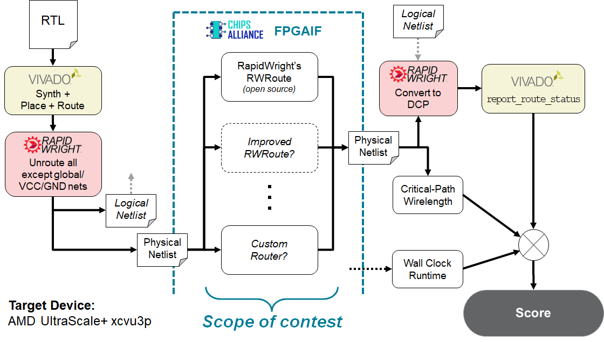

# Contest Details

## Key Details

* The target device for this contest will be the AMD/Xilinx UltraScale+ xcvu3p.
* Competing routers must consume a pre-placed and partially-routed
 [FPGA Interchange Format](http://www.rapidwright.io/docs/FPGA_Interchange_Format.html) Physical Netlist
  and emit a fully routed Physical Netlist.
* The exact scoring criteria is currently being developed, but will be composed of:
    1. Legal routing solution (must pass for valid score)
    2. Wall-clock time (large weight)
    3. Wirelength of critical-path (small weight)
    4. *Other to-be-announced criteria*
* Contestants can expect to be evaluated on an AMD multi-core Linux platform with >=32 cores, >=64GB RAM,
  and no internet connectivity.
  We are working on providing access to AMD compute and GPU resources for benchmarking purposes;
  more details will be released and communicated to registered teams in due course.

## Framework

As stated in the [Introduction](index.html#introduction), the input to the router will be a pre-placed
but partially routed FPGAIF design.
Specifically, to lower the barrier to entry, only signal nets are required to be routed -- all global (e.g. clock) and
static (VCC/GND) nets are pre-routed and **must** be fully preserved (i.e. cannot be ripped up and rerouted).
Furthermore, the existing placement (including all intra-site routing) **must** also be fully preserved.
Violation of these requirements will result in no score.
A more detailed look at the contest flow is shown below: 

#### Pre-routing
Starting from benchmarks described in RTL, Vivado is used to synthesize, place, and route each design.
[RapidWright](https://www.rapidwright.io/) then takes that fully-routed Vivado result, unroutes all signal
nets (preserving only global, VCC and GND nets) and writes this result out into FPGA Interchange Format
Logical and Physical Netlists.
These steps are not mandatory for contestants to run -- a number of FPGAIF benchmarks are provided (with more
to follow).

Should contestants wish to test/train with more benchmarks than those that are provided, the 
[`DcpToFPGAIF`](https://github.com/Xilinx/fpga24_routing_contest/pull/10) utility is provided.

#### Router
With just the pre-placed but partially-routed input Physical Netlist, competitors are required to route all
signal nets while preserving all existing placement and routing. This fully-routed result must then be written
out as a new Physical Netlist.

#### Post-routing
Once this fully-routed Physical Netlist is ready, RapidWright takes it again and combines it with the previous
Logical Netlist in order to reconstitute a Vivado Design Checkpoint.
Here, Vivado’s `report_route_status` command is used to verify that the design is indeed fully-routed --
that no nodes have multiple drivers (overlaps), and that all there is complete connectivity from all source
pins to all sink pins. Returning the design into Vivado allows us to take advantage of its robust legality
checking capabilities, as well as demonstrating that the FPGAIF is able to capture all the design state required
to interface with an industrial tool.
In addition, for the cases where a contestant’s router does not behave as expected, one can also leverage the
GUI and other capabilities of Vivado to aid debugging.

The output Physical Netlist will also be analyzed to compute its critical-path wirelength, which will make up
a small weight of the score.
This metric serves as a simple-to-compute proxy for critical-path delay thus incentivizing contestants to not
give up on quality-of-results entirely.
The details of how Critical-Path Wirelength will be computed are presented on
the [Scoring Criteria](score.html#critical-path-wirelength-algorithm) webpage.
Additionally a tool to compute this Critical-Path Wirelength, called `wa.py` is
supplied in the [GitHub repository](https://github.com/Xilinx/fpga24_routing_contest/tree/master/wirelength_analyzer).

Finally, all scoring components – legality of routing solution, wall-clock router runtime, critical-path wirelength
(plus more) will be combined under a to-be-determined formula to produce the final score.

## Getting Started

Get started [here](start.html)!
