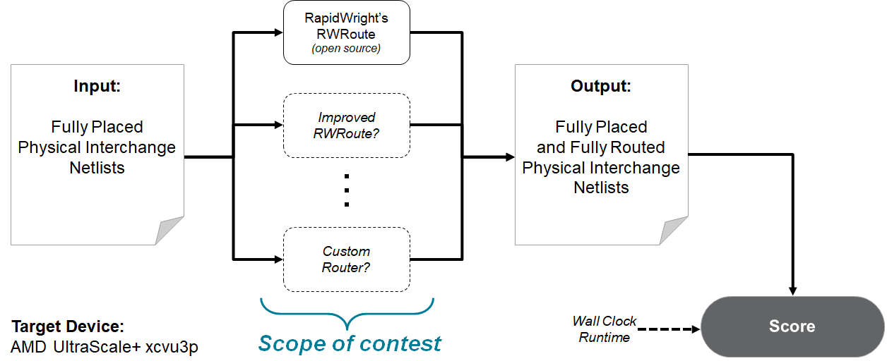

# Runtime-First FPGA Interchange Routing Contest @ [FPGA'24](https://www.isfpga.org/)

## The Challenge

Given a pre-placed design in the [FPGA Interchange Format](http://www.rapidwright.io/docs/FPGA_Interchange_Format.html)
and a multi-core machine with an AMD GPU, build a router that focuses on minimizing the wall-clock time required to return
a legal, fully routed solution.

| ℹ️ **NOTE:** | This contest has now concluded!<br>[Link to the results and details from our top 5 teams](results.html). |
| - | - |

## Introduction

Compilation times for FPGA technology have long been a pain point, compounded by the trend that FPGA devices are only
getting bigger.
Routing is one of the last steps of this compilation flow, involving the search for a set of non-overlapping paths
through the FPGA's routing graph connecting all source pins to all sink pins.
Since processor core counts continue to grow rapidly (the latest AMD EPYC processors have up to 128 cores in a single
socket) alongside the evolution of GPU technology, can a FPGA router be built to take advantage of all this compute?

As most FPGA vendor tools are provided as closed-source binaries, it can be difficult to innovate
at the backend (i.e. place and route) with many researchers resorting to evaluating their algorithms on theoretical
rather than commercial architectures.
To lower the barrier and cost to future innovation, in this contest we use the open-source
[FPGA Interchange Format](http://www.rapidwright.io/docs/FPGA_Interchange_Format.html) (FPGAIF) as the intermediate representation
for device model and design exchange.

**The goals of this contest are:**
1. To promote and demonstrate the [FPGA Interchange Format](http://www.rapidwright.io/docs/FPGA_Interchange_Format.html) as an
   efficient and robust intermediate representation for working on backend FPGA problems --- even at industrial scales.
2. To encourage innovation in FPGA routing algorithms that prioritize runtime, a metric that can be especially
   important in some application domains such as ASIC emulation.


To this end, the biggest component of the contest score will be wall-clock time (in contrast to user-CPU time, which
is the time that each CPU core was busy summed across all cores).
*In other words: we'll provide the (AMD) CPU cores and the GPUs -- use them or lose them!*

Developed as part of the [CHIPS Alliance](https://www.chipsalliance.org/), the open-source
[FPGA Interchange Format](http://www.rapidwright.io/docs/FPGA_Interchange_Format.html) (FPGAIF) can describe
(a) the layout of all available device resources present on an FPGA,
(b) the hierarchical logical netlist produced post-synthesis, and
(c) the flat physical netlist capturing how and where each FPGA resource is configured/placed
and how they are connected/routed together.
The overarching vision for the FPGAIF is to act as the intermediate representation for a
common set of FPGA tools -- fundamentally, the placement and routing problems across many devices
share many similarities -- as well as efficient mix-and-matching from different tool stacks.

The input and output of a competing router will be an FPGAIF physical netlist, as shown below:
[](flow-simple.png)
More information can be found in [Contest Details](details.html).


## Important Dates

|Date | |
|-----------------|-------|
|September 2023   | Contest Announced |
|~20 October 2023~<br>**EXTENDED 20 November 2023**| Registration Deadline ([mandatory, see below](#registration))|
|20 December 2023 | Alpha Submission ([details](alpha_submission.html))|
|31 January 2024  | Final Submission ([details](final_submission.html))|
|3-5 March 2024   | Prizes awarded to top 5 teams at [FPGA 2024 conference](https://www.isfpga.org/)|

Deadlines refer to Anywhere On Earth.

## Prizes 

Prizes will be awarded to up to 5 finalists:

| Rank | Prize (USD) |
|------|-------------|
| 1st  | **$2500** |
| 2nd  | **$1500** |
| 3rd  | **$1000** |
| 4th & 5th | **$500** |

Prize amounts subject to change.

***Note 1:*** *50% of the prize money is conditional on the winning entry being made open source under a permissive license (BSD, MIT, Apache) within 30 days of award announcement. This is to encourage participants to help the FPGA backend community and ecosystem grow faster.*  
***Note 2:*** *Applicable taxes may be assessed on and deducted from award payments, subject to U.S. and/or local government policies.*

## Registration 

Contest registration is mandatory to be eligible for alpha submission and final prizes. To register, please [send an email](mailto:eddie.hung@amd.com) with the following information:
* Subject: `FPGA24 Contest Registration`
* Body:
  ```
  Team name: <TEAM NAME>
  Team members and affiliation:
    <NAME> (<AFFILIATION>)
    <NAME> (<AFFILIATION>)
  Advising Professor (if applicable): <NAME> (<AFFILIATION>)
  Single corresponding email: <NAME@AFFILIATION.COM>
  ```

Team size is limited to 6 members (not including advisor(s)).

A Vivado license is not mandatory for router development, however, eligible teams from academia can ask their advising professor to apply for a donation of a Vivado license from the AMD University Program.
If your advisor is not already enrolled with the AMD University Program, please ask them to enroll [here](https://www.xilinx.com/member/xup.html).
Once the enrollment has been approved, the advisor can access the donation request form [here]( https://www.xilinx.com/member/xup/xup_donation_request.html).
Please ask your advisor to request the number of Vivado licenses you need and add a reference to the ISFPGA contest in the comments section of the donation form.


## Disclaimer

The organizers reserve the rights to revise or modify any aspect of this contest at any time.
