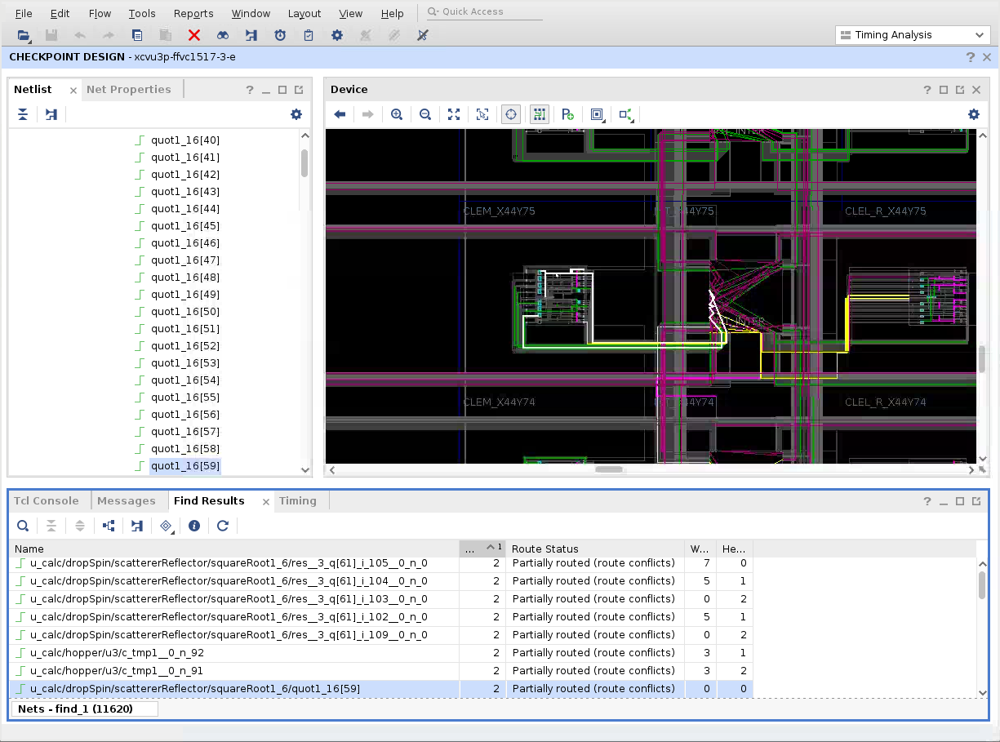

# Getting Started

Contestants may choose from the following two options to get started:
* [Getting Started With RWRoute](#getting-started-with-rwroute)
* [Getting Started With A Custom Router](#getting-started-with-a-custom-router) (NXRoute)

All contest collateral is distributed at [`https://github.com/Xilinx/fpga24_routing_contest`](https://github.com/Xilinx/fpga24_routing_contest), containing:
- A set of pre-placed and partially-routed FPGAIF Physical Netlist benchmarks for input into
  the router.
- A corresponding set of FPGAIF Logical Netlists, to be reconstituted with the router's output
  Physical Netlist to generate a Vivado Design Checkpoint (DCP).
- Source code to support this Getting Started guide.
- [Reference runs using GitHub Actions](#reference-runs-using-github-actions).

Once up and running, you may wish to consult the [Advanced Routing Topics](advanced.html) page.

**TL;DR**
> ```
> git clone --recurse-submodules https://github.com/Xilinx/fpga24_routing_contest
> cd fpga24_routing_contest
> make
> ```

> ℹ️ **NOTE:**  
> Where Vivado is required (to check the validity of or to inspect the routed result)
> you will need the Vivado ML Enterprise Edition (not Standard Edition).

## Getting Started with RWRoute

RWRoute is an open-source router provided by Java-based [RapidWright](https://github.com/Xilinx/RapidWright).
More details on its inner workings can be found in [this publication](https://www.rapidwright.io/docs/_downloads/11ba50239531ec18c016b0df9dddda3a/RWRoute_final_submitted.pdf).

RWRoute serves as the baseline router for this competition, and contestants are encouraged to
improve upon it.

To get started with RWRoute on Linux:
```
# 0. Clone the competition GitHub repository, including any Git submodules (e.g. RapidWright)
#    and then enter into this directory
git clone --recurse-submodules https://github.com/Xilinx/fpga24_routing_contest
cd fpga24_routing_contest

# 1. Compile and run RWRoute on all provided benchmarks
#    (this may take several hours)
make
```

### Dissecting `make`

Upon calling `make` the default [Makefile](https://github.com/Xilinx/fpga24_routing_contest/blob/master/Makefile) recipe is executed:
1. All Java source code in the repository (including in the RapidWright submodule) is compiled.
2. For each benchmark the [`PartialRouterPhysNetlist`](https://github.com/Xilinx/fpga24_routing_contest/blob/main/src/com/xilinx/fpga24_routing_contest/PartialRouterPhysNetlist.java) Java class is executed.
   This class leverages RapidWright to load the FPGAIF Physical Netlist into RapidWright's in-memory data
   structures, then invokes `PartialRouter` (which is a subclass of `RWRoute` that operates only on
   unrouted nets while preserving all existing routing) to complete routing.

   > ℹ️ **NOTE:**  
   > By default, `PartialRouterPhysNetlist` is configured with 32GB of heap memory for its Java Virtual Machine.
   > With this configuration, to account for off-heap memory utilization a machine with at least 40GB of free memory is required.
   > The heap size can be overridden using the following variable `make JVM_HEAP="-Xms14g -Xmx14g"` --
   > we have determined experimentally that a minimum heap size of 14GB is necessary to complete the 5 initial benchmarks
   > (at a cost to performance).
   
   Lastly, RapidWright's in-memory representation of the fully-routed design is then written out into a
   new FPGAIF Physical Netlist.
   The wall-clock time of this `PartialRouterPhysNetlist` step is captured using `/usr/bin/time`.
3. The validity of the routed FPGAIF Physical Netlist is then checked using the [`CheckPhysNetlist`](https://github.com/Xilinx/fpga24_routing_contest/blob/main/src/com/xilinx/fpga24_routing_contest/CheckPhysNetlist.java)
   Java class.
   This class takes the original FPGAIF Logical Netlist, combines it with the routed Physical Netlist
   to generate a Vivado Design Checkpoint (DCP) and loads it in Vivado to undergo `report_route_status`
   (see [Contest Details](details.html#framework)).  
   *Note: This scoring tool does not check that the output netlist's placement and intra-site routing is
   identical to the input netlist's, these capabilities will be added soon.*
4. Finally, [`compute-score.py`](https://github.com/Xilinx/fpga24_routing_contest/blob/master/compute-score.py) is called to generate output that looks like:
   ```
   +------------------------------+------+------------------+--------------------------+---------+
   | Benchmark                    | Pass | Wall Clock (sec) | Critical-Path Wirelength | Score   |
   +------------------------------+------+------------------+--------------------------+---------+
   | vtr_mcml_rwroute             | True |           644.02 |                      642 |  643.82 |
   | rosetta_fd_rwroute           | True |           421.75 |                      894 |  468.98 |
   | koios_dla_like_large_rwroute | True |           920.04 |                      555 |  883.54 |
   | ispd16_example2_rwroute      | True |          1332.61 |                      993 | 1298.65 |
   | boom_soc_rwroute             | True |          3285.00 |                     1786 | 3135.10 |
   +------------------------------+------+------------------+--------------------------+---------+
   ```
   This table shows all of the criteria used to evaluate the performance of a
   router on each benchmark, as well as the score that has been achieved on
   that benchmark. The results of `CheckPhysNetlist` are marked either `True`
   (if there are no routing errors) or `False` in the `Pass` column. The wall
   clock runtime and [critical-path wirelength](score.html#critical-path-wirelength)
   are displayed in the next two columns. The score achieved on each benchmark
   is displayed in the final column. The details of how this score is computed
   are discussed on the [Scoring Criteria](score.html) webpage.

The terminal output of RWRoute for each benchmark is available at `<Benchmark>_rwroute.phys.log`
while the output of `CheckPhysNetlist` can be found at `<Benchmark>_rwroute.check.log`.
Displaying this output on screen in addition to writing to these logs can be achieved by setting
the `VERBOSE` flag: `make VERBOSE=1`.

### Improving On The Baseline

With the baseline RWRoute working and its performance established, contestants may wish to
improve on this result.
Doing so would require modifying the Java source code in which RWRoute is written.
Since the RapidWright repository is already checked out as a Git submodule, one can edit
(for example) the `RapidWright/src/com/xilinx/rapidwright/rwroute/RWRoute.java` source file
and then do:

```
# 2. Clean all results from previous run, necessary to force them to be regenerated
make clean

# 3a. OPTION A: Compile and re-run RWRoute on all provided benchmarks
make

# 3b. OPTION B: Compile and re-run RWRoute on a subset of benchmarks
make BENCHMARKS="vtr_mcml rosetta_fd"
```

Contestants are encouraged to fork this contest and the RapidWright repositories to develop on.


## Getting Started with A Custom Router

Besides RWRoute, contestants are also free to adapt existing routers or build their own from scratch.
The key requirement is that such routers must be able to accept an FPGAIF Physical Netlist as the input
description for a pre-placed and partially-routed design, and able to emit a Physical Netlist as the
output description.

Unlike RWRoute, a custom router would also need to know exactly what resources exist on the target FPGA
(e.g. the exact arrangement of all routing wires and switches and their connectivity) -- information that
RWRoute has access to through RapidWright.
Fortunately, the FPGA Interchange Format also supports this information through its DeviceResources
specification.


### Generating FPGAIF DeviceResources

To generate this device information for this contest's target device:
```
# 0. Clone the competition GitHub repository, including any Git submodules (e.g. RapidWright)
#    and then enter into this directory
git clone --recurse-submodules https://github.com/Xilinx/fpga24_routing_contest
cd fpga24_routing_contest

# 1. Output DeviceResources into the `xcvu3p.device` file (this may take several minutes)
make xcvu3p.device
```

With the information contained in this resources file, a contestant now has a description of the FPGA's
full routing graph.
Contestants are free to generate this file offline and bundle it with their router submission, or they
are free to extract any and all information contained within and adapt it in any way they see fit for
the most efficient router possible.

Besides the reference code provided as part of NXRoute (see below) the contents of the DeviceResources file is
[documented here](https://fpga-interchange-schema.readthedocs.io/) along with other example code for
reading it is available in RapidWright's
[`DeviceResourcesVerifier`](https://github.com/Xilinx/RapidWright/blob/master/src/com/xilinx/rapidwright/interchange/DeviceResourcesVerifier.java)
class (which is also called from
[`DeviceResourcesExample`](https://github.com/Xilinx/RapidWright/blob/master/src/com/xilinx/rapidwright/interchange/DeviceResourcesExample.java#L59-L61)
).


### NXRoute

A proof-of-concept, bare-bones, Python-based router that derives all its data from FPGAIF
inputs (including DeviceResources) and using [NetworkX](https://networkx.org/) is provided in the
[`networkx-proof-of-concept-router/`](https://github.com/fpga24_routing_contest/tree/main/networkx-proof-of-concept-router) subdirectory.
Specifically, this code demonstrates how an FPGA Interchange Device Resources
file can be parsed to extract the complete routing graph, as well as how an
Interchange Physical Netlist can be parsed to determine the source and sink
pins/nodes to be routed, and how to insert the routed result back into the
output Physical Netlist.

Please examine the comments within the [`nxrouter-poc.py`](https://github.com/Xilinx/fpga24_routing_contest/blob/main/networkx-proof-of-concept-router/nxroute-poc.py) source code for an explanation of
its limitations, how NetworkX is employed, why valid solutions are not returned, and more.

> ⚠️ **WARNING**  
> We DO NOT recommend the NXRoute proof-of-concept implementation be used as the baseline
> for any contest entry, but merely as a reference example.

NXRoute can be executed in the following manner:
```
# 0. Clone the competition GitHub repository, including any Git submodules (e.g. RapidWright)
#    and then enter into this directory
git clone --recurse-submodules https://github.com/Xilinx/fpga24_routing_contest
cd fpga24_routing_contest

# 1. Compile and run NXRoute on all provided benchmarks
#    (this may take up to an hour; requires python3 on $PATH)
make ROUTER=nxroute-poc
```

NXRoute is able to generate a fully routed solution (for the subset of the device it operates on)
but unlike RWRoute it makes no attempt to resolve overlaps, thus its score is expected
to be `inf`.

The terminal output of NXRoute for each benchmark is available at `<Benchmark>_nxroute-poc.phys.log`
while the output of `CheckPhysNetlist` can be found at `<Benchmark>_nxroute-poc.check.log`.
An example `vtr_mcml_nxroute-poc.phys.log` shows:
```
Building routing graph...
	Read DeviceResources: 17.7s
	Build 1104220 graph nodes: 54.3s
	Build 4729124 graph edges: 28.2s
	Build lookups: 0.2s
Parsing design...
	Read PhysicalNetlist: 1.0s
	Prepare site pins: 9.2s
Routing 40827 pins...
	Routed 10000 pins: 8.8s
	Routed 20000 pins: 16.9s
	Routed 30000 pins: 24.8s
	Routed 40000 pins: 34.1s
	Routed 40827 pins: 34.8s
Writing design...
	Inserting 233219 PIPs and 1595 strings: 4.4s
	Write PhysicalNetlist: 7.7s
Wall-clock time (sec): 168.94
```
Displaying this output on screen in addition to writing to these logs can be achieved by setting
the `VERBOSE` flag: `make VERBOSE=1`.

### Inspecting Solutions using Vivado

One can then open up the `vtr_mcml_nxroute-poc.dcp` in Vivado and run `report_route_status`
explicitly:
```
Design Route Status
                                               :      # nets :
   ------------------------------------------- : ----------- :
   # of logical nets.......................... :      190324 :
       # of nets not needing routing.......... :      119342 :
           # of internally routed nets........ :      107680 :
           # of nets with no loads............ :       11554 :
           # of implicitly routed ports....... :         108 :
       # of routable nets..................... :       70982 :
           # of unrouted nets................. :       54766 :
           # of fully routed nets............. :        4647 :
       # of nets with routing errors.......... :       11569 :
           # of nets with some unrouted pins.. :         711 :
           # of nets with resource conflicts.. :       11472 :
   ------------------------------------------- : ----------- :
```
as well as to use its GUI to visualize resource conflicts, which may be helpful
when debugging your own router. For example, executing the following command in the Tcl
Console:
```
show_objects -name find_1 [get_nets -hierarchical -top_net_of_hierarchical_group -filter { ROUTE_STATUS == "CONFLICTS" } ]
```
will create a new tab containing all the conflicting nets.
Clicking on a net will cause the Device view to select and zoom to that net (shown in white):

[](vivado-conflict.png)

Note that the above screenshot above shows the Device view with the Unrouted Nets
(red) and Partially Routed Nets (yellow) hidden from display.
What remains are Fully Routed Nets (green) and Conflict Nets (dark magenta).
Control of which net types are displayed can be accessed by clicking the blue "gear" icon
in the top right of the GUI.

### Reference FPGAIF Physical Netlist Reader/Writer

Besides the reference code provided as part of NXRoute, the RWRoute flow above leverages RapidWright
to read and write the Physical Netlist using the
[`PhysNetlistReader`](https://github.com/Xilinx/RapidWright/blob/master/src/com/xilinx/rapidwright/interchange/PhysNetlistReader.java)
and
[`PhysNetlistWriter`](https://github.com/Xilinx/RapidWright/blob/master/src/com/xilinx/rapidwright/interchange/PhysNetlistWriter.java)
classes.
These sources may serve as additional reference implementations for developing your own Physical Netlist
readers and writers.


## Reference Runs Using GitHub Actions

Up-to-date reference runs of RWRoute and NXRoute are available through
[GitHub Actions](https://github.com/Xilinx/fpga24_routing_contest/actions?query=branch%3Amaster)
with the following caveats:
1. Since GitHub Actions has no access to Vivado, the `report_route_status` functionality always returns a mock *pass* status.
2. Due to GitHub Actions' memory limitations (7GB RAM) RWRoute can only tackle the two smallest benchmarks.
3. As NXRoute only operates on one clock region of the device, it can partially route all five benchmarks.

